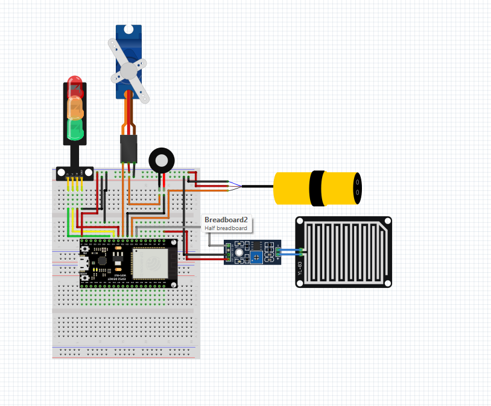
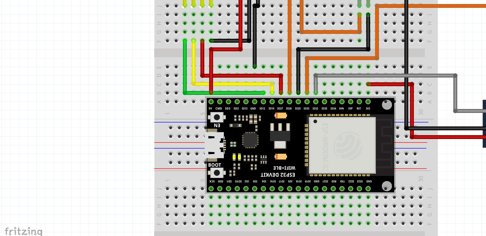

# ♻️ Proyek Pemilah Sampah Basah dan Tidak Basah Otomatis

Sistem ini menggunakan **ESP32** untuk memilah jenis sampah berdasarkan kelembapan (basah atau tidak basah) menggunakan **Rain Sensor** dan **Infrared Sensor**. Hasil deteksi akan digerakkan oleh **Servo Motor**, serta ditampilkan melalui **lampu indikator** (Traffic Light) dan **buzzer** sebagai notifikasi suara.

---

## 🎯 Tujuan Proyek

Meningkatkan efisiensi pemilahan sampah di tahap awal dengan sistem otomatis, cocok untuk lingkungan rumah, sekolah, atau proyek edukasi berbasis IoT.

---

## 🛠️ Komponen yang Digunakan

| Komponen           | Jumlah | Keterangan                          |
|--------------------|--------|--------------------------------------|
| ESP32 Dev Board    | 1      | Mikrocontroller utama                |
| Infrared Sensor    | 1      | Untuk deteksi keberadaan sampah     |
| Rain Sensor (digital) | 1   | Untuk mendeteksi kelembapan sampah  |
| Servo Motor MG90S  | 1      | Menggerakkan pemilah sampah          |
| LED Merah          | 1      | Indikator standby                   |
| LED Kuning         | 1      | Indikator proses deteksi            |
| LED Hijau          | 1      | Indikator proses selesai            |
| Buzzer             | 1      | Notifikasi bunyi                    |
| Breadboard & Kabel Jumper | - | Untuk koneksi ( Secukupnya )                       |

---

## 🔌 Wiring (Pinout ESP32)

| Komponen      | Pin ESP32 |
|---------------|-----------|
| Infrared Sensor | D33 |
| Rain Sensor     | D32 |
| Servo Motor     | D26 |
| LED Merah       | D27 |
| LED Kuning      | D14 |
| LED Hijau       | D12 |
| Buzzer          | D25 |

---

## ⚙️ Cara Kerja Sistem

1. **Standby Mode**  
   - LED Hijau menyala menandakan sistem siap mendeteksi.

2. **Deteksi Sampah Masuk**  
   - Infrared sensor mendeteksi keberadaan sampah.
   - LED kuning menyala menandakan sistem sedang mendeteksi jenis sampah.

3. **Deteksi Basah atau Tidak**  
   - Rain sensor mendeteksi apakah sampah tersebut basah (nilai digital LOW) atau tidak basah (HIGH).

4. **Pemilahan Sampah**  
   - Jika basah → servo bergerak ke kiri (posisi 45°).  
   - Jika tidak basah → servo bergerak ke kanan (posisi 135°).

5. **Notifikasi Selesai**  
   - LED Merah menyala.
   - Buzzer berbunyi singkat sebagai tanda proses selesai.

6. **Reset Posisi**  
   - Servo kembali ke posisi tengah (90°).
   - LED kembali ke Hijau (standby).

---

## 📸 Sketsa Rangkaian

---

## 👨‍💻 Source Code

> File kode lengkap bisa kamu buka di `code.ino`  
> Jangan lupa install library `ESP32Servo.h` di Arduino IDE.
> Dan jika perangkat kamu belum support board esp32, silahkan tonton tutorial pada link [Berikut](https://www.youtube.com/watch?v=h-jqF8Y5iV4)

---

## 📢 Catatan Tambahan
- Sensor IR biasanya aktif saat **LOW** (logika terbalik).
- Pastikan sensor rain tidak terkena air berlebihan / terendam lama agar awet.

---

## 🤖 Rekomendasi Fitur Tambahan
- Project ini bisa dikembangkan agar ada wifi untuk penggunaan lebih kompleks
- Bisa juga di hubungkan dengan bot telegram Sebagai Database / Informasi
- Bisa dikembangkan menggunakan komponen lainnya untuk kontrol penuh fitur

<i>Powered By FarSyaFad Tech 2025 | All Right Reserved | Created By Ahnaf Samih</i>

